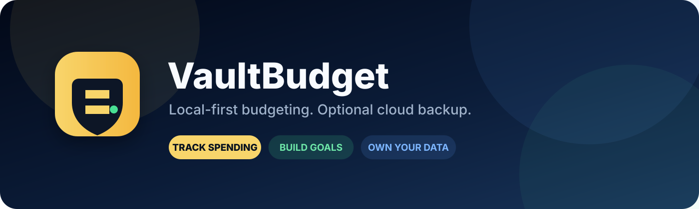

<p align="center">
  
</p>

<h1 align="center">VaultBudget</h1>

<p align="center">
  A polished, local-first personal budgeting dashboard with optional Supabase account backup.
</p>

<p align="center">
  <a href="https://vault-budget-ai.netlify.app"><strong>🚀 Live Demo — vault-budget-ai.netlify.app</strong></a>
</p>

<p align="center">
  
  
  
  
</p>

## ✨ Overview

**VaultBudget** is a browser-based budgeting app designed around a simple idea: your budget should work even without an account or backend.

The app stores data locally in the browser by default. Users can track income and spending, create savings goals, view reports, export their data, and optionally connect a Supabase account for **manual account backup**.

## 🔥 Features

| Area | What VaultBudget Includes |
|---|---|
| 💰 Dashboard | Live balance, daily spending, spending limit progress, low-balance warnings |
| 💸 Transactions | Income and expense tracking with categories, notes, and timestamps |
| 🎯 Goals | Savings goals, progress tracking, quick allocations, completion status |
| 📊 Reports | Spending totals, category visualization, monthly spending summary |
| 👤 Profile | Display name, savings stats, streaks, achievements |
| ⚙️ Settings | Currency, daily limit, low-balance threshold, local reset |
| 📤 Exports | CSV transactions, JSON backup, text report |
| ☁️ Cloud backup | Optional Supabase sign-up/login, manual backup, and restore |

## 🔐 Privacy-First Architecture

VaultBudget is **local-first**.

- The app works without creating an account.
- Budget data is saved in browser `localStorage`.
- Supabase is optional.
- Cloud writes only happen when the user presses **Backup now**.
- The browser configuration uses only the **public anon/publishable key**.
- Service-role keys, database passwords, owner passwords, and private tokens should never be committed.
- Supabase tables use **Row Level Security (RLS)** so authenticated users can access only their own rows.

> VaultBudget is a personal project and not a bank, financial institution, or financial-advice service.

## 🧱 Architecture

```text
Browser
├── index.html
├── styles.css
├── app.js
│   ├── localStorage state
│   ├── transactions
│   ├── savings goals
│   ├── reports
│   ├── exports
│   └── optional cloud actions
│
└── Optional Supabase
    ├── Authentication
    ├── vault_profiles
    ├── vault_settings
    ├── vault_transactions
    ├── vault_goals
    ├── vault_recurring_expenses
    └── Row Level Security
```

## 🚀 Run Locally

Because VaultBudget is a static web app, setup is lightweight.

### Option 1 — Open directly

Clone or download the repository, then open `index.html` in your browser.

### Option 2 — Use a local server

```bash
python -m http.server 8000
```

Then open:

```text
http://localhost:8000
```

A local server is recommended when testing module imports or browser security behavior.

## ☁️ Optional Supabase Setup

VaultBudget does **not** require Supabase for normal local use.

To enable account backup:

1. Create or select a Supabase project.
2. Run `supabase-vaultbudget.sql` once in the Supabase SQL Editor.
3. Open `supabase-config.js`.
4. Add your public project URL and public anon/publishable key.

```js
window.VAULTBUDGET_CONFIG = {
  SUPABASE_URL: "https://YOUR_PROJECT.supabase.co",
  SUPABASE_ANON_KEY: "YOUR_PUBLIC_ANON_KEY",
};
```

Never place a service-role key, database password, or private token in client-side code.

### Backup flow

```text
Local save
   ↓
Create account / log in
   ↓
Confirm email if required
   ↓
Press "Backup now"
   ↓
User-owned rows are saved to Supabase
```

No automatic background sync is required for normal use.

## 📤 Data Export

VaultBudget currently supports:

- **CSV** — transaction history
- **JSON** — full local backup
- **Text report** — balance, income, spending, goals, and counts

This makes it easier for users to keep their own copy of their data.

## 📁 Repository Structure

```text
VaultBudget1/
├── index.html
├── styles.css
├── app.js
├── supabase-config.js
├── supabase-vaultbudget.sql
├── privacy.html
├── terms.html
├── README.md
└── assets/
    └── vaultbudget-banner.svg
```

## 🛡️ Supabase Security

The included SQL setup:

- Enables RLS on VaultBudget data tables
- Connects user-owned rows to `auth.users`
- Restricts authenticated access to the current user's data
- Avoids exposing service-role credentials in frontend code
- Keeps cloud backup explicitly user-triggered

## 🗺️ Roadmap

- [ ] Improve transaction filtering and search
- [ ] Add editable recurring expenses
- [ ] Add richer report periods and comparisons
- [ ] Add import / restore for JSON backups
- [ ] Improve desktop layouts while keeping the mobile-first experience
- [ ] Add automated UI and data-validation tests
- [ ] Add installable PWA support

## 🤝 Contributing

This project is still evolving. Issues and constructive feedback are welcome.

If you want to contribute:

1. Fork the repo
2. Create a feature branch
3. Make a focused change
4. Test it locally
5. Open a pull request explaining what changed

## ⚠️ Project Status

VaultBudget is an active portfolio project. Features and data structures may change as the project is improved.

---

<p align="center">
  <strong>Private by default. Useful by design.</strong>
</p>
